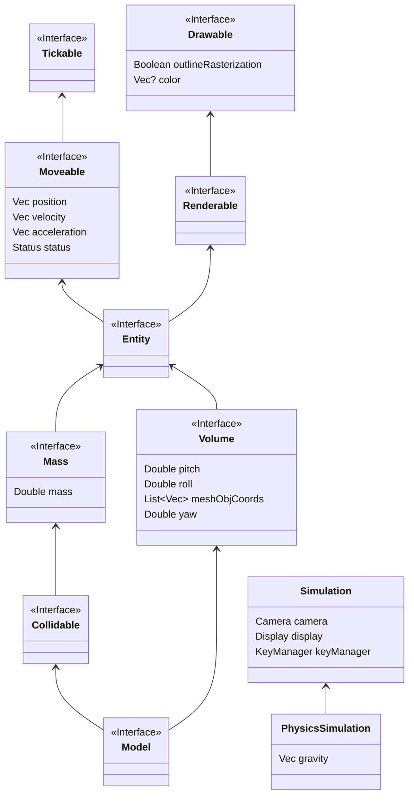

### Intro
This framework provides the possibility to run small simulations. I see this project as a fun challenge for me. The Code is 100% Java/Kotlin and self written. The rendering is happening on the CPU and therefore not as performant.
The following interfaces are available (in package `framework.interfaces` except simulation in package `framework`):

Additionally, some implementations of the interfaces are also available, mainly `PointMass`, `Sphere`, and `ImpulseConnection` (all in package physics)
# Usage
```
/**
 * We create a new simulation where a ball bounces up and down
 */
class BouncingBall: PhysicsSimulation("Bounce") {
    private lateinit var ball: Sphere
    init {
        reset()
        camera.focalLength = 10.0
        camera.x = 0.0
        camera.y = -25.0
        camera.z = 3.0
        camera.phi = PI
        camera.theta = PI / 2
        camera.focalLength = 10.0
        camera.zoom = 0.01
    }

    /**
     * Calc forces is invoked once per tick and enables us to apply gravity to the ball and invert its direction if needed.
     */
    override fun calcForces() {
        if (ball.position.z < ball.radius && ball.velocity.z < 0) {
            ball.velocity.z = -ball.velocity.z
        }
        applyGravity(listOf(ball))
    }

    /**
     * Reset the Ball
     */
    override fun reset() {
        super.reset()
        ball = Sphere(1.0, 0.0, 4.0, 2.0, 1.0)
        register(ball)
        ball.color = Color.BLUE.toVec()
    }
}
```

# Todos
1. GJK
2. Warum schwingt der Bums in die eine Richtung mehr, als in die andere
3. Anti Aliasing
4. BVH
5. Performance
