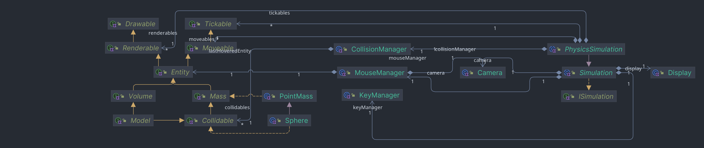

# Getting Started
This framework provides the possibility to run small simulations. I see this project as a fun challenge for me. The Code is 100% Java/Kotlin and self written. The rendering is happening on the CPU and therefore not as performant.
The following interfaces are available (in package `framework.interfaces` except simulation in package `framework`):



Additionally, some implementations of the interfaces are also available, mainly `PointMass`, `Sphere`, and `ImpulseConnection` (all in package physics)
# Usage
## Basic example
The following example creates a Sphere located at the origin with no specified behaviour:
The Simulation class handles the invocations of `tick` and `render` and implements a `KeyManager`
that handles the movement of the camera with `W,A,S,D,shift` and `space` and resetting of the 
simulation with `n`. Additionally, a `MouseManager` is also implemented to drag element on the screen.
### Code
```Kotlin
class JustASphere: Simulation("Sphere") {
    private val dot = Sphere(0.0, 0.0, 0.0, 1.0, 1.0)
    init {
        reset()
    }

    override fun tick(dt: Seconds) = Unit
    override fun render() = dot.render(camera)

    override fun reset() {
        dot.x = 0.0
        dot.y = 0.0
        dot.z = 0.0
        camera.focalLength = 10.0
        camera.x = 0.0
        camera.y = -25.0
        camera.z = 0.0
        camera.theta = PI / 2
        camera.phi = PI
        camera.focalLength = 10.0
        camera.zoom = 0.001
    }
}
```
### Result

[](https://player.vimeo.com/video/914137859?h=add79d45cf)

## Add Behaviour
To add complex behaviour to the ball we can implement it in the `tick(dt: Seconds)`.
Alternatively, the abstract class `PhysicsSimulation` together with the entities inside the package physics offers 
additional built in behaviour like gravity, air resistance, collisions, or connections.

The `setup` method defines the initial state.

Each entity that should be taken care of by the `PhysicsSimulation` must be registered by the
`register(Any)` method.
### Code
```Kotlin
class ShotPutPendulum: PhysicsSimulation("Shot put pendulum") {
    init {
        setup()
        configureCamera()
    }

    override fun setup() {
        val colors = listOf(
            Color.BLUE.toVec(), Color.RED.toVec(), Color.GREEN.toVec(), Color.YELLOW.toVec(),
            Color.ORANGE.toVec(), Color.MAGENTA.toVec(),Color.PINK.toVec()
        )
        val balls = List(7) {Sphere(it.toDouble(), 0.0, 0.0, 0.5, 1.0).apply { color = colors[it] }}
        val anchors = List(7) {Sphere(it.toDouble(), 0.0, 4.0, 0.5, 1.0).apply { status = Status.Immovable }}
        anchors.forEach { it.color = Color.GRAY.toVec() }
        val links = List(7) { ImpulseConnection(balls[it], anchors[it], 4.0, 1000.0) }
        balls[0].set(Vec3(-4, 0.0, 4.0))

        balls.forEach { register(it) }
        anchors.forEach { register(it) }
        links.forEach { register(it) }
    }

    private fun configureCamera() {
        camera.focalLength = 10.0
        camera.x = 0.0
        camera.y = -37.0
        camera.z = 0.5
        camera.phi = PI
        camera.theta = PI / 2
        camera.focalLength = 10.0
        camera.zoom = 0.01
    }
}
```
### Result

[](https://player.vimeo.com/video/914137849?h=add79d45cf)

# Todos
1. GJK
2. Warum schwingt der Bums in die eine Richtung mehr, als in die andere
3. Anti Aliasing
4. BVH
5. Performance
