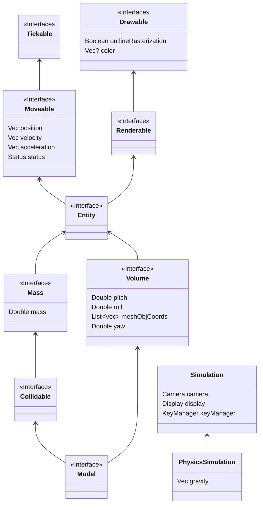

### Intro
This framework provides the possibility to run small simulations. I see this project as a fun challenge for me. The Code is 100% Java/Kotlin and self written. The rendering is happening on the CPU and therefore not as performant.
The following interfaces are available (in package `framework.interfaces` except simulation in package `framework`):

Additionally, some implementations of the interfaces are also available, mainly `PointMass`, `Sphere`, and `ImpulseConnection` (all in package physics)
# Usage
TODO

# Todos
1. Color scheme
2. 
